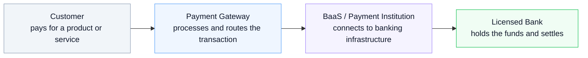
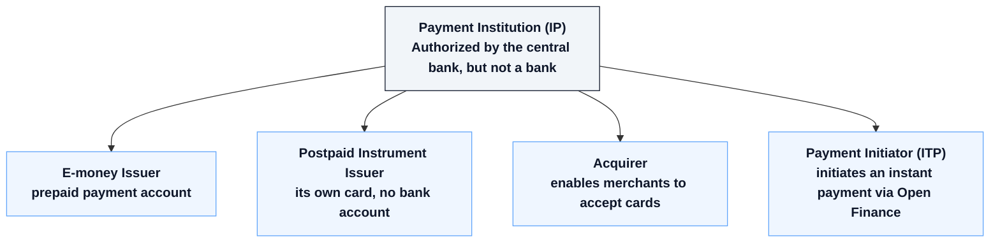

## Why this matters right now

Recent cases, like the Banco Master scandal in Brazil, made it clear that "being regulated" and "looking trustworthy" are two very different things. The financial market has grown fast over the last few years (fintechs, digital banks, BaaS, gateways) and from the outside, all of it tends to blur into the same mental category: "a company that touches my money."

It's not the same thing. And the difference between these layers is exactly what determines **who's accountable for your money if something goes wrong**.

Having worked on payment infrastructure for the last few years (first at PagueSafe, then as CTO at Upay), this question came up constantly, from partners and end users alike. So let's simplify it.

## Bank: the one with the license, holding the money

A bank is a financial institution authorized to operate by the central bank. That's not bureaucracy for its own sake: it means the bank must maintain minimum capital, follow heavy compliance rules, report its operations, and, most importantly for you, **deposits are insured** up to the legal limit by the country's deposit guarantee fund.

When your money "is at the bank," it's held by an institution that answers directly to the regulator. It's the most protected layer in the chain.

## BaaS (Banking as a Service): the infrastructure behind the brand

BaaS is the model where a technology company offers "banking services" via API (a digital account, a card, instant payments, boleto) without being a licensed bank itself. In practice, the BaaS provider connects the end client's application to the infrastructure of a **licensed partner bank**, which is the one actually holding the funds and appearing (sometimes buried in the terms of service) as the responsible institution.

This is how a fintech can launch "its own digital account" in months, not years: it doesn't build a bank from scratch, it rents the license and infrastructure of one that already exists.

The catch: **not every BaaS is transparent about which bank is behind it**. And the soundness of your account depends directly on that partner bank, not on the polished brand of the app you're using.

## Payment Gateway: it processes, it doesn't hold

A payment gateway is the technical layer that processes a transaction: it receives the instant payment, validates the card, routes it to the right acquirer, confirms the payment. At Upay and, before that, at PagueSafe, that was exactly the role of the infrastructure I architected: orchestrating instant payments, cards and boletos between merchant, acquirer and settlement bank.

In most models, the gateway **doesn't hold the money indefinitely**. It processes the transaction and passes the funds along the chain: to the settlement bank, to the merchant's account. It's movement infrastructure, not custody.

## The flow, visually

## Where does the Payment Institution (IP) fit in?

In the diagram above, "BaaS" tends to hide an important detail: in Brazil, most gateways and BaaS providers don't operate "outside" of regulation. They're themselves a licensed **Payment Institution (Instituição de Pagamento, or IP)**, authorized by the central bank under Law 12.865/2013 and BCB Resolution 80/2021.

An IP is not a bank: it doesn't lend with its own capital and, as a rule, isn't covered by deposit insurance. But it's not an unregulated layer either: it's supervised by the central bank, must segregate customer funds, and has to follow anti-money-laundering rules. The regulator recognizes four modalities:

In practice, Upay, PagueSafe, and most Brazilian gateways fall under **e-money issuer** or **acquirer**: they can hold a payment account (segregated, audited, supervised by the regulator) without being a bank. It's a regulated middle ground: more protected than a pure technology layer, but without a bank's deposit-insurance guarantee.

## What to ask before trusting a platform with your money

Having seen this market from the inside, the questions I ask myself before using any new financial product are simple:

1. **Who's the financial institution behind this?** Any serious platform discloses this in its terms of service: if it's hidden, that's a red flag.
2. **Is that institution regulated by the central bank?** You can usually check the regulator's public registry for who's authorized to operate.
3. **Is it covered by deposit insurance?** If the product is a payment account (not a bank), it usually isn't, and that changes the risk.
4. **Is the gateway/BaaS just the face of the product, or also the legal custodian of my funds?** They're not always the same company.

Understanding these layers isn't about distrusting everything: it's about knowing exactly where your money sits at each step, and who's accountable if things go off script. After the recent scandals, that's a question worth learning to ask.
