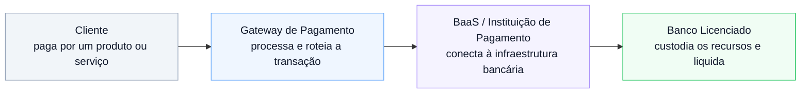
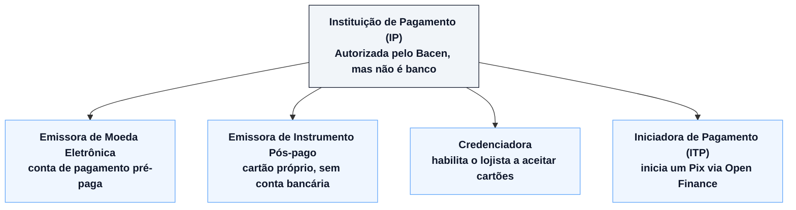

## Por que isso importa agora

Casos recentes, como o do Banco Master, deixaram bem claro que "ser regulado" e "parecer confiável" são coisas diferentes. O mercado financeiro brasileiro cresceu rápido nos últimos anos (fintechs, bancos digitais, BaaS, gateways) e, pra quem está de fora, tudo isso meio que vira a mesma caixinha mental: "empresa que mexe com meu dinheiro".

Só que não é a mesma coisa. E a diferença entre essas camadas é exatamente o que determina **quem responde pelo seu dinheiro se algo der errado**.

Trabalhando com infraestrutura de pagamentos nos últimos anos (primeiro na PagueSafe, depois como CTO da Upay), essa pergunta apareceu o tempo todo, de parceiros e de usuários finais. Então vamos simplificar.

## Banco: quem tem a licença e custodia o dinheiro

Um banco é uma instituição financeira autorizada a funcionar pelo Banco Central. Isso não é burocracia por burocracia: significa que ele precisa manter capital mínimo, seguir regras de compliance pesadas, reportar operações e, o mais importante pra você, **os depósitos têm garantia do FGC** (Fundo Garantidor de Créditos) até o limite estabelecido por lei.

Quando o dinheiro "está no banco", ele está custodiado por uma instituição que responde diretamente ao regulador. É a camada mais protegida da cadeia.

## BaaS (Banking as a Service): a infraestrutura por trás da marca

BaaS é o modelo em que uma empresa de tecnologia oferece "serviços bancários" via API (conta digital, cartão, Pix, boleto) sem ela mesma ser um banco licenciado. Na prática, o provedor de BaaS conecta a aplicação do cliente final à infraestrutura de um **banco parceiro licenciado**, que é quem de fato custodia os recursos e aparece (às vezes escondido nos termos de uso) como instituição responsável.

É assim que uma fintech consegue lançar "sua própria conta digital" em meses, e não anos: ela não constrói um banco do zero, ela aluga a licença e a infraestrutura de quem já tem.

O ponto de atenção: **nem todo BaaS é transparente sobre quem é o banco por trás**. E a solidez da sua conta depende diretamente da solidez desse banco parceiro, não da marca bonita do app que você usa.

## Gateway de Pagamento: processa, não guarda

Um gateway de pagamento é a camada técnica que processa uma transação: recebe o Pix, valida o cartão, roteia para o adquirente certo, confirma o pagamento. Na Upay e, antes, na PagueSafe, era exatamente esse o papel da infraestrutura que arquitetei: orquestrar PIX, cartão e boleto entre lojista, adquirente e banco liquidante.

O gateway, na maioria dos modelos, **não custodia o dinheiro por tempo indeterminado**. Ele processa a transação e repassa os recursos adiante na cadeia: para o banco liquidante, para a conta do lojista. É infraestrutura de movimentação, não de custódia.

## O fluxo, visualmente

## E a Instituição de Pagamento (IP), onde entra?

No diagrama acima, o "BaaS" costuma esconder um detalhe importante: no Brasil, a maior parte dos gateways e provedores de BaaS não opera "por fora" da regulação. Eles são, eles mesmos, uma **Instituição de Pagamento (IP)** autorizada pelo Banco Central, sob a Lei 12.865/2013 e a Resolução BCB 80/2021.

Uma IP não é um banco: não empresta dinheiro com capital próprio e, via de regra, não tem garantia do FGC. Mas também não é uma camada "não regulada": ela é supervisionada pelo Bacen, precisa segregar os recursos dos clientes e seguir regras de prevenção à lavagem de dinheiro. O Bacen reconhece quatro modalidades:

Na prática, a Upay, a PagueSafe e a maioria dos gateways brasileiros se enquadram como **emissoras de moeda eletrônica** ou **credenciadoras**: eles podem manter uma conta de pagamento (segregada, auditada, sob supervisão do Bacen), mesmo sem serem um banco. É um meio-termo regulado: mais protegido do que uma camada de tecnologia pura, mas sem o mesmo nível de garantia de um banco com FGC.

## O que perguntar antes de confiar seu dinheiro a uma plataforma

Depois de ver esse mercado por dentro, as perguntas que eu mesmo faço antes de usar qualquer produto financeiro novo são simples:

1. **Quem é a instituição financeira por trás disso?** Toda plataforma séria informa isso nos termos de uso: se está escondido, é sinal de alerta.
2. **Essa instituição é regulada pelo Banco Central?** Dá pra checar no site do Bacen quem tem autorização para funcionar.
3. **Tem garantia do FGC?** Se o produto é uma conta de pagamento (não um banco), normalmente não tem, e isso muda o risco.
4. **O gateway/BaaS é só a cara do produto, ou também o responsável legal pelos meus recursos?** Nem sempre são a mesma empresa.

Entender essas camadas não é sobre desconfiar de tudo: é sobre saber exatamente onde seu dinheiro está em cada etapa, e quem responde por ele se algo sair do script. Depois dos escândalos recentes, essa é uma pergunta que vale a pena aprender a fazer.
